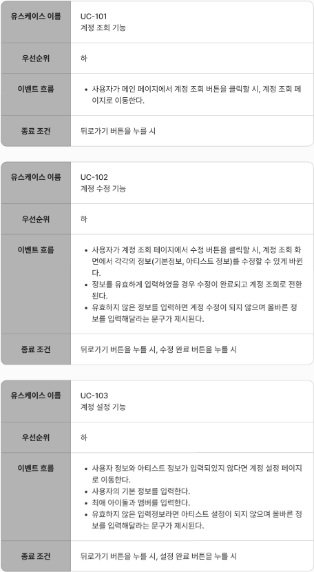
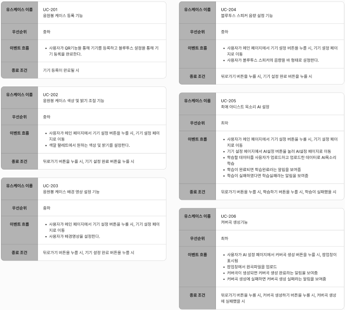
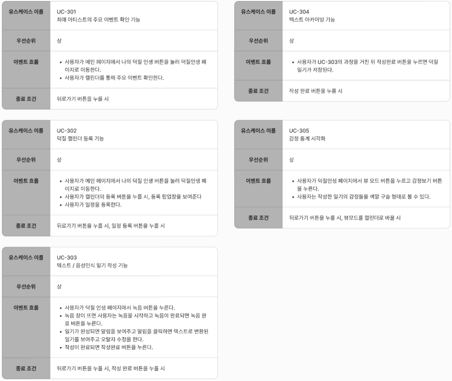
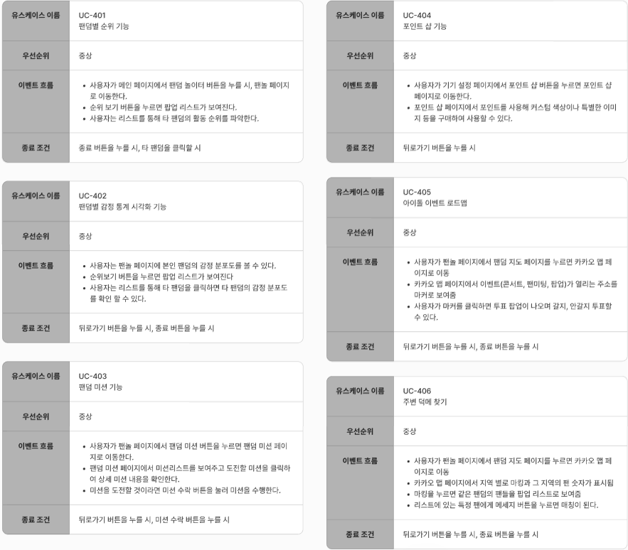

<h1>LG전자 DX School CX Project-TFisland</h1>

 
# 1. Light Me! &#x1F387;
- K-POP 팬들을 위한 덕질 어플리케이션
 
## 2. 멤버 및 기간
- 2024.09.10 ~ 2024.09.12
 
 
 
- 민희원(LG전자 DX School): 팀장, CX 내용 피피티 작성
- 김주원(LG전자 DX School): 화면 디자인 및 피피티 디자인
- 신하경(LG전자 DX School): 화면 설계서 작성 및 BX 피피티 내용 작성
- 이창윤(LG전자 DX School): 서버 사이드 개발
- 김현태(LG전자 DX School): 클라이언트 사이드 개발
 
 
## 3. 기술스택
### 3-1. 클라이언트 기술스택

 
### 3-2. 백엔드 기술스택

 
## 4. ERD

## 5. 기능 명세서

  
유즈케이스

  
### 5-1. 계정

 

### 5-2. 설정 기능

 

### 5-3. 사용자 인터랙션 기능

 

### 5-4. 팬덤 활동 및 관리 기능

## 6. 화면 설계서

    
UI 설계

  
### 6-1. 메인화면 & 계정 설정

 
### 6-2. 덕질 인생 페이지

 
### 6-3. 팬덤 놀이터 페이지

 
### 6-4. 배경 & 기기 설정 페이지

